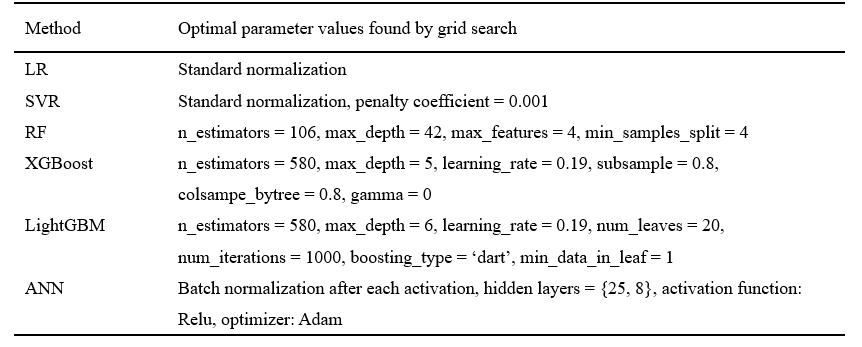

# Predicting heat transfer of oscillating heat pipes for machining processes based on extreme gradient boosting algorithm
  https://www.sciencedirect.com/science/article/pii/S1359431119351531
  
Ning Qian, Xuesong Wang, Yucan Fu*, Zhengcai Zhao, Jiuhua Xu
## Prerequisite python packages
This code requires python 2.7+ and the following packages:

numpy, pandas, matplotlib, sklearn, xgboost, lightgbm

* to install a package, open a ternimal and use pip install command, e.g.
  ```bash
  pip install numpy
  ```

* To check sklearn, xgboost and lightgbm official documents at:

  https://scikit-learn.org/stable/index.html#

  https://xgboost.readthedocs.io/en/latest/index.html

  https://lightgbm.readthedocs.io/en/latest/index.html

* to visualize tree structure of xgboost (self.plot_estimator("tree") in main.py), graphviz also needs to be installed

* to run ANN.py, tensorflow and Keras are required to be installed

## Run
* to see results of XGBoost or comparing methods on training, validation and testing set, run 
  ```bash
  python regression/main.py
  ```
   change "model _index" in regression/main.py can switch testing methods from XGBoost to others like Random Forest
   
* run ANN.py separately if you want to see ANN result
 
 
## Cross validation and grid search strategy of XGBoost
* cross validation is a good strategy to split training and validation data when the quantaty of data is very limited.
  This also helps find optimal parameters for a model, details see 
  
  https://scikit-learn.org/stable/modules/cross_validation.html#multimetric-cross-validation 

* grid search is a strategy to search for the best parameter in a parameter set, details see
 
  https://scikit-learn.org/stable/modules/grid_search.html#grid-search

  to see how to choose best parameters in main.py, run
    ```bash
  python regression/main_grid_search.py
  ```
  this may need 1-2 hours to run if you define a big searching grid.
  
  The optimal parameters used in the paper were given as below.
  
  
  
  

## Code Structure for XGBoost in main.py
1. Read data: read original training data and testing data
2. Choose a model by model_index:
  
    0: Linear Regression(LR), 1: Support Vector Regression(SVR), 2: Random Forest, 
     3: XGBoost, 4: LightGBM
3. If model == LR or SVR, normalize data first
4. Generate validation set from training data
5. Initialize training parameters of a list of models
6. Train models with training data and select the best model with the lowest prediction error on the validation set
7. Test the best model with the testing set
8. plot y_predicted - y_true figures of the best method (plot_coefficient)
9. plot decision boundaries of the best model
